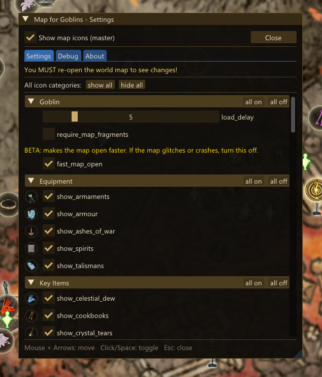

# ELDEN RING Map For Goblins - DLL

<p align="center">
  <a href="https://github.com/VirusAlex/ERR-MapForGoblins-DLL/releases/latest"></a>
  <a href="https://github.com/VirusAlex/ERR-MapForGoblins-DLL/releases"></a>
  <a href="https://www.nexusmods.com/eldenring/mods/10062"></a>
  <a href="https://discord.gg/JvTMwPCygB"></a>
  <a href="LICENSE.txt"></a>
</p>

A DLL mod for Elden Ring that adds thousands of icons to the world map: weapons, armor, spells, quest items, bosses, NPCs, gathering nodes, etc. Nine builds, each generated from that game/mod's own data: [ERR](https://www.nexusmods.com/eldenring/mods/541) (~9000 icons, including ERR-specific content like Rune Pieces), the vanilla game + Shadow of the Erdtree (~6700 icons), [The Convergence](https://www.nexusmods.com/eldenring/mods/3419) 2.x and 3.x (~7200 each; separate builds because 2.x runs on ModEngine2 and 3.x on ModEngine3), [ERTE](https://www.nexusmods.com/eldenring/mods/2747) (~8000), [Elden Ring Golden Age](https://soulsmods.com/mods/cmkst0a23000009jlzm0f1jvs/elden-ring-golden-age-overhaul-mod) (~6700), [ELDEN VINS](https://www.nexusmods.com/eldenring/mods/4709) (~7500), [Elden Ring Reborn](https://www.nexusmods.com/eldenring/mods/2202) (~6900), and [Graceborne](https://www.nexusmods.com/eldenring/mods/5207) (Bloodborne-inspired, ~7100).

**Download:** [Nexus Mods](https://www.nexusmods.com/eldenring/mods/10062) · **Community:** [Elden Ring - DLL Mods Discord](https://discord.gg/JvTMwPCygB)

<p align="center">
  
  <br>
  <em>In-game mod menu (F10 / Y+R3): toggle any icon category live, no ini editing.</em>
</p>

Unlike [Map for Goblins](https://www.nexusmods.com/eldenring/mods/3091), this mod does not modify `regulation.bin`. All map point data is injected into memory at runtime, so it won't conflict with other regulation edits.

> **Note:** OFFLINE only. This is an unofficial mod, not affiliated with the ERR team or any of the overhaul authors (Convergence, ERTE, Golden Age, ELDEN VINS, Reborn, Graceborne).

Collected Rune Pieces, Ember Pieces and gathering nodes are automatically hidden on the map using real-time memory detection of the game's geometry object state.

## Features

- In-game overlay menu (Dear ImGui) in its own top-most window - D3D11 + DirectComposition, with a GDI layered fallback auto-selected on Proton/Wine; it does NOT hook the game's swapchain, so it coexists with ReShade / Special K / frame-gen overlays. Open with **F10** (keyboard) or **Y+R3** (gamepad). Tabs: **Settings** (toggle categories, master switch, Show all / Hide all, text-size + opacity sliders, `overlay_render_mode` surface/layered/swapchain), **Progress**, **Hidden**, **Debug**. Mouse/keyboard/controller; category toggles apply live on the open map
- **Progress tab**: collected/total per region, grouped into The Lands Between / the Underground / Shadow of the Erdtree (minor caves/catacombs folded into their parent region); click a category to highlight only its uncollected markers on the live map (works regardless of the map-fragment gate)
- **Manual per-marker hide**: hover a marker on the world map and press **Delete** (or gamepad **RB**) to hide it; the Hidden tab lists and restores them; the hidden set persists per save slot
- Passive hover tooltip (near the cursor) showing the hovered marker's name and its height relative to you
- ~9000 map icons across 60+ toggleable categories (configurable via INI or the overlay)
- Map text sourced from existing in-game FMG entries (all 14 languages) via a MsgRepository hook - each marker redirects to a goods/weapon/armour/etc. name by ID, so translations come for free; overlay UI is localized in 8 languages
- Collected Rune/Ember Piece detection: GEOF singletons for unloaded tiles + CSWorldGeomMan flags for loaded tiles
- [Item & Enemy Randomizer](https://www.nexusmods.com/eldenring/mods/428) support (vanilla build, on by default): loot markers read the loaded `ItemLotParam` from live memory at startup, so each shows the item actually placed by your seed (name + icon) and hides on the real light-point pickup - seed-agnostic, no per-seed data
- Spoiler-free mode (`anonymous_loot` INI option): every loot marker shows a gray "?" icon and a generic localized label instead of the real item, for blind / randomizer runs
- No regulation.bin changes - no conflicts with other mods
- Addon-compatible folder structure for ERR

## Building

Requirements:
- Visual Studio 2022 (Build Tools or Community)
- CMake 3.28+
- Internet connection (CMake fetches dependencies on first configure)

```bash
build.bat              # configure + build
build.bat snapshot     # run the full data pipeline + build + package into pre-release/
build.bat release      # same as snapshot, but non-pre version + bumps patch version
build.bat generate     # run the data pipeline only (no DLL build)
build.bat clean        # delete build directory
```

Every command builds the ERR profile by default. Append `--vanilla`,
`--convergence2`, `--convergence3`, `--erte`, `--goldenage`, `--vins`,
`--reborn`, or `--graceborne` to build the other profiles (own data/source/build/package
dirs; see `tools/config.ini.example` for the required paths). `convergence2` / `convergence3`
target The Convergence 2.x (ModEngine2) and 3.x (ModEngine3) respectively - same
data pipeline, the install method differs. The overhaul profiles (convergence2 /
convergence3 / erte / goldenage / vins / reborn / graceborne) stage a merged overlay-over-vanilla
source view first, since those overhauls ship a partial ModEngine overlay.

The vanilla profile reads `regulation.bin`, `map/mapstudio/*.msb.dcx`,
`event/*.emevd.dcx`, `msg/*/*.msgbnd.dcx` and `menu/02_120_worldmap.gfx` from
`game_dir`, with `eldenring.exe` and `oo2core_6_win64.dll` next to them. A full
UXM unpack has all of that; a partial one must include the files from `DLC.bdt`
too, or the bake silently drops every Realm of Shadow marker (~5600 entries
instead of ~6900).

Output: `build/Release/MapForGoblins.dll` + `MapForGoblins.ini`

## Installation

Grab a packaged release from [Nexus Mods](https://www.nexusmods.com/eldenring/mods/10062) - it has step-by-step instructions for every build (ERR; vanilla via ModEngine2/me3; the overhauls - Convergence, ERTE, Golden Age, ELDEN VINS, Reborn, Graceborne - via their bundled ModEngine2 / Mod Engine 3).

The mod is a single DLL (no gfx or extra files) - manual install of the ERR build:
1. Copy `MapForGoblins.dll` and `MapForGoblins.ini` to your ERR `dll/offline/` directory.
All map data is compiled into the DLL itself - no external data files needed at runtime.

## Data Pipeline

The mod's map data is generated from ERR game files through a Python pipeline
orchestrated by `tools/build_pipeline.py` (18 stages, hash-based incremental cache):

```
MSB + regulation.bin + EMEVD
    │
    ├─► extract_all_items.py        → items_database.json
    ├─► build_entity_index.py       → msb_entity_index.json
    ├─► scan_emevd_awards.py        → emevd_lot_mapping.json
    ├─► enrich_fallback_with_emevd.py (upgrades unmatched records in-place)
    │
    ├─► generate_loot_massedit.py   → 50+ Loot/Equipment/Key/Quest/Magic MASSEDIT
    ├─► generate_pieces_massedit.py → Rune/Ember MASSEDIT + slot mappings
    ├─► generate_material_nodes.py, generate_graces.py, generate_summoning_pools.py,
    │   generate_spirit_springs.py, generate_imp_statues.py, generate_stakes.py,
    │   generate_paintings.py, generate_maps.py, generate_gestures.py,
    │   generate_hostile_npcs.py    → world-infrastructure MASSEDIT
    │
    └─► generate_data.py → goblin_map_data.cpp + goblin_legacy_conv.hpp
                              │
                              └─► build.bat → MapForGoblins.dll
```

### Python Setup

```bash
pip install -r requirements.txt
cp tools/config.ini.example tools/config.ini
# Edit config.ini with paths to your ERR mod and game directories
```

See [tools/README.md](tools/README.md) for detailed script documentation.

## Project Structure

```
MapForGoblins/
├── src/                    C++ DLL source code
│   ├── generated/          Auto-generated data (from Python pipeline)
│   ├── from/               Game engine structures (params, paramdefs)
│   └── goblin/             Mod-specific headers (structs, flags, tiles)
├── tracker/                RunePieceTracker - standalone piece tracking DLL
├── data/
│   ├── massedit_generated/ MASSEDIT files (auto-generated map icon definitions)
│   └── *.json, *.csv       Extracted game data (items, entity index, EMEVD map, ...)
├── tools/                  Python scripts (extraction, generation, analysis)
│   ├── lib/                Andre.SoulsFormats.dll + dependencies
│   ├── paramdefs/          Elden Ring param field definitions (XML)
│   └── fmg_patcher/        C++ tool for FMG binary patching
├── assets/                 Icon PNGs (map_icons/custom/) + logo
├── docs/                   Technical documentation
│   ├── KNOWLEDGE_EN.md     Knowledge base (English)
│   ├── KNOWLEDGE_RU.md     Knowledge base (Russian)
│   └── geom_collection_tracking.md  Geom object collection detection
├── CMakeLists.txt
├── build.bat
├── MapForGoblins.ini       DLL configuration (icon category toggles)
└── requirements.txt        Python dependencies
```

## Documentation

- [Knowledge Base (EN)](docs/KNOWLEDGE_EN.md) / [База знаний (RU)](docs/KNOWLEDGE_RU.md) - DLL architecture, data formats, research notes
- [Geom Collection Tracking](docs/geom_collection_tracking.md) - how collected Rune Pieces are detected from process memory
- [Tools README](tools/README.md) - Python script documentation and usage

## Credits

This project builds on the work of many people and projects:

### Game & Mod

- **FromSoftware** - Elden Ring
- **Elden Ring Reforged** team - the overhaul mod that inspired this project. Thanks to [**ividyon**](https://github.com/ividyon) and the ERR Discord
- **Gacsam** - [Goblin-ERR](https://github.com/Gacsam/Goblin-ERR), the original map icons mod for ERR. MapForGoblins started as a fork of this project and reuses its map fragment logic
- **Harmonixer** - [Map for Goblins](https://www.nexusmods.com/eldenring/mods/3091), the original Elden Ring map icons mod that started it all
- **Convergence Team** - [The Convergence](https://www.nexusmods.com/eldenring/mods/3419), the overhaul the Convergence 2.x and 3.x builds target
- **ERTE author** - [ERTE](https://www.nexusmods.com/eldenring/mods/2747), the overhaul the ERTE build targets
- **Elden Ring Golden Age** team - [Elden Ring Golden Age](https://soulsmods.com/mods/cmkst0a23000009jlzm0f1jvs/elden-ring-golden-age-overhaul-mod), the overhaul the Golden Age build targets
- **mayk** - [ELDEN VINS](https://www.nexusmods.com/eldenring/mods/4709), the overhaul the ELDEN VINS build targets
- **H A L C Y O N** - [Elden Ring Reborn](https://www.nexusmods.com/eldenring/mods/2202), the overhaul the Reborn build targets
- **Noctis** - [Graceborne](https://www.nexusmods.com/eldenring/mods/5207), the Bloodborne-inspired overhaul the Graceborne build targets

### Libraries & Tools

- **vawser** - [Smithbox](https://github.com/vawser/Smithbox) / Andre.SoulsFormats.dll, the From Software file format library that powers all data extraction (bundled in `tools/lib/`)
- **mountlover** - [DSMSPortable](https://github.com/mountlover/DSMSPortable), used during early development for regulation and FMG editing
- **ThomasJClark** - [elden-ring-glorious-merchant](https://github.com/ThomasJClark/elden-ring-glorious-merchant/), reference for DLL mod architecture and param injection techniques
- **Dasaav-dsv** - [Pattern16](https://github.com/Dasaav-dsv/Pattern16), AOB pattern scanner; [libER](https://github.com/Dasaav-dsv/libER), Elden Ring C++ library (referenced during development)
- **vswarte** - [fromsoftware-rs](https://github.com/vswarte/fromsoftware-rs), From Software format implementations (referenced during development)
- **TsudaKageyu** - [MinHook](https://github.com/TsudaKageyu/minhook), API hooking framework
- **gabime** - [spdlog](https://github.com/gabime/spdlog), logging library
- **metayeti** - [mINI](https://github.com/metayeti/mINI), INI file parser
- **ocornut** - [Dear ImGui](https://github.com/ocornut/imgui), the in-game config overlay UI
- **[Claude Code](https://claude.com/claude-code)** (Anthropic) - heavy lifting on the data-extraction pipeline automation and on reverse-engineering the game's in-memory geom-object state (the collected-piece detection research)

### Contributors

- **[yun-wulian](https://github.com/yun-wulian)** - Chinese (Simplified & Traditional) overlay localization and an in-menu multi-controller gamepad fix.
- **[yeousherang](https://github.com/yeousherang)** - Korean overlay localization.

### Community

Thanks to the ERR Discord for testing and bug reports, especially **AngryPhilosopher** and **Spiswel** for early testing of the DLL version, and **darksucklet** for help debugging the geom-object (collected-piece) tracking.

## License

MIT-style, see [LICENSE.txt](LICENSE.txt) - includes the original [Goblin-ERR](https://github.com/Gacsam/Goblin-ERR) notice (this project started as its fork) and the bundled third-party licenses (Pattern16, MinHook, HDE64, mINI, spdlog, Dear ImGui).
